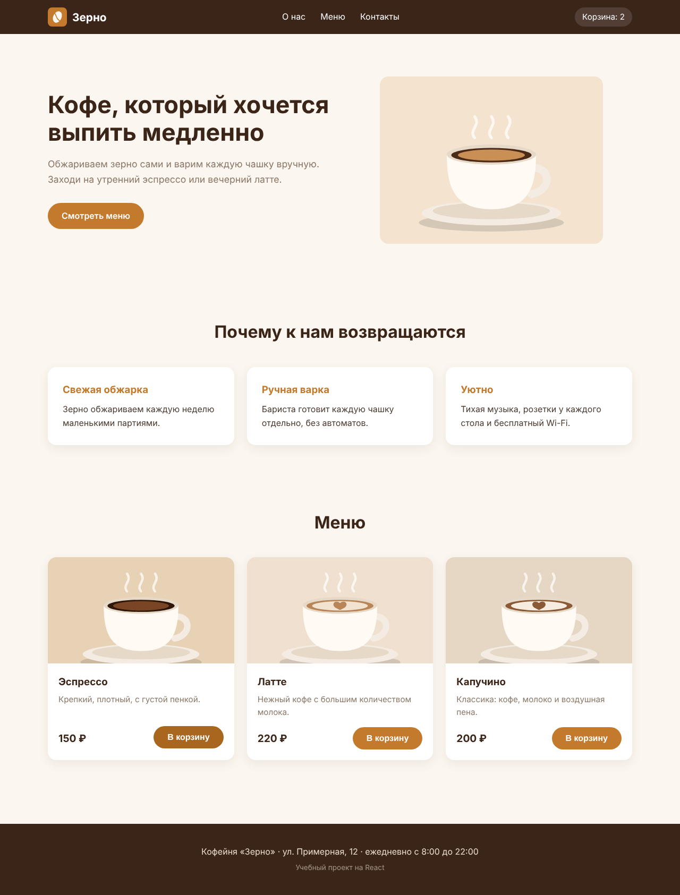

# 1. С чего начинать, если хочешь написать свой сайт

В конце этого курса вы научитесь запускать свой локальный сайт (localhost) и получите минимальную базу, с которой можно дальше изучать React самостоятельно.

Вот такой сайт у вас будет в конце:

Это одностраничная кофейня: шапка с меню, большой заголовок с картинкой, три карточки «почему мы», список напитков с кнопкой «В корзину» и подвал. Кнопка по-настоящему работает: нажимаете, и число в шапке растёт.

## Для кого этот курс

Для тех, кто хочет сделать свой первый сайт и не знает, с какого конца подступиться. Опыт программирования не нужен.
Помощь влиться в систему для дальнейшего изучения

## Содержание курса

1. Что вы сейчас читаете и что получится в конце.
2. Установка всего необходимого.
3. Настройка VS Code и начало создание проекта на React.
4. Написание самой страницы: теги, компоненты, стили.
5. Загрузка проекта на GitHub.
6. Итоги.

## Что понадобится

- VS Code
- Node.js (в него уже входит NPM)
- Git и Git Bash
- Аккаунт на GitHub
- Браузер (подойдёт любой, например Chrome)

Всё это бесплатное. Как поставить, написано в следующем разделе.

## С чего начать

Сначала стоит понять три вещи, без них дальше будет непонятно.

**Что такое React.** Это библиотека для JavaScript, которая помогает собирать сайт из маленьких кусочков, называемых компонентами. Шапка сайта это один компонент, карточка напитка другой. Один раз написали карточку, и дальше можно показать её хоть десять раз с разными данными.

**Что такое Node.js и NPM.** Node.js позволяет запускать JavaScript не в браузере, а прямо на вашем компьютере. React-проект без него не соберётся. NPM это магазин пакетов, который идёт вместе с Node.js: одной командой он скачивает в проект нужные чужие библиотеки, включая сам React.

**Что такое localhost.** Это адрес вашего собственного компьютера. Когда вы запускаете проект командой, на компьютере поднимается маленький сервер, и сайт открывается по адресу вида `http://localhost:5173`. Видите его только вы, в интернет он не выложен. Выкладывать сайт в интернет в этом курсе мы не будем.

Дальше: [установка программ](02-install.md).
